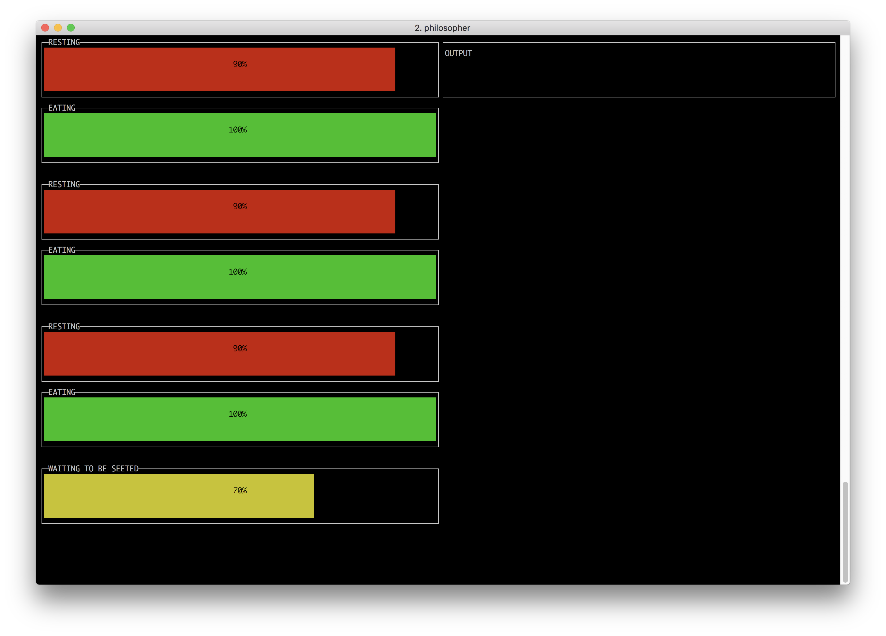
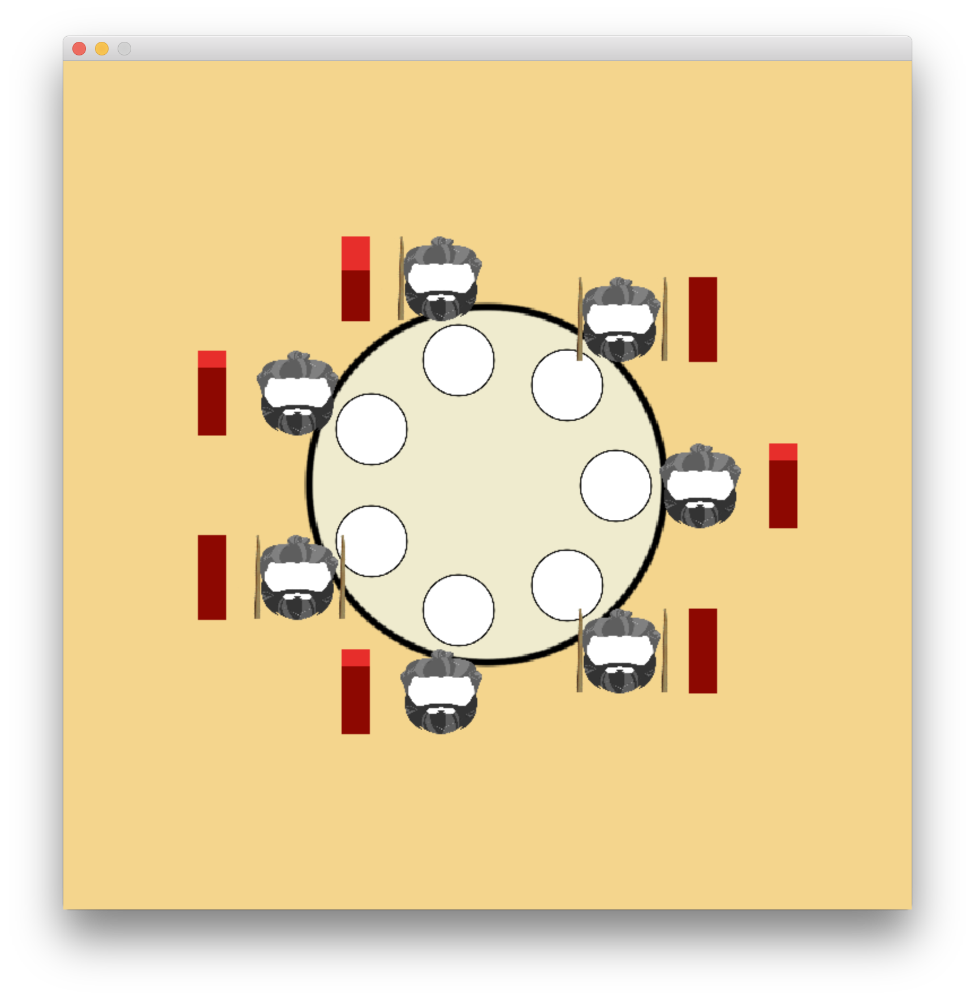

# Philosophers

7 philosophers are seated around a table

Between each pair of philosophers is one chopstick

A philosopher must hold two chopsticks to eat

He can:

* eat - hold two chopsticks
* rest - hold no chopsticks
* think - hold one chopstick

After eating he must rest

After resting he can eat or think

Manage the allocation of resources so they all get a chance to eat

[wikipedia](https://en.wikipedia.org/wiki/Dining_philosophers_problem)

[swanson](http://adit.io/posts/2013-05-11-The-Dining-Philosophers-Problem-With-Ron-Swanson.html)

## Dependencies

* go 1.13
* make
* libpthread
* libsdl2

## Build

```
make
```

## Usage

```
./philo_go	# run go version
./philo_c 5	# run c version with n philosophers
```

## Algorithm

### Go

Uses a semaphore to limit access to the table

At least one philosopher is always waiting to be seated, leaving everyone with enough utensils to eat



### C

Handles resource contention by giving the stick to the philosopher with a lower id

This makes sure everyone is not left with one chopstick, resulting in a deadlock


